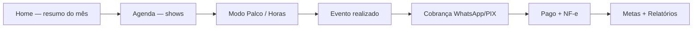

# Backstage Pro — Guia Completo do Projeto

> **Documento mestre** para humanos, Cursor e Claude Code.  
> Consolida tudo que os agentes sabem sobre o produto: objetivo, funcionamento, estado atual e destino.  
> **Última atualização:** 2026-08-28  
> **Produção:** https://backstage-pro-beta.vercel.app  
> **Supabase ref:** `cwtallnetgodoacuoaow`

---

## Índice

1. [O que é o Backstage Pro](#1-o-que-é-o-backstage-pro)
2. [Para quem é](#2-para-quem-é)
3. [Objetivo e visão](#3-objetivo-e-visão)
4. [Como o app funciona (visão do usuário)](#4-como-o-app-funciona-visão-do-usuário)
5. [Arquitetura técnica](#5-arquitetura-técnica)
6. [Mapa de telas e rotas](#6-mapa-de-telas-e-rotas)
7. [Módulos principais](#7-módulos-principais)
8. [Integrações e IA](#8-integrações-e-ia)
9. [Design e identidade visual](#9-design-e-identidade-visual)
10. [Estado atual (agosto 2026)](#10-estado-atual-agosto-2026)
11. [O que ainda não funciona 100%](#11-o-que-ainda-não-funciona-100)
12. [Para onde queremos chegar](#12-para-onde-queremos-chegar)
13. [Como Cursor e Claude Code trabalham juntos](#13-como-cursor-e-claude-code-trabalham-juntos)
14. [Documentação de referência](#14-documentação-de-referência)
15. [Comandos úteis](#15-comandos-úteis)

---

## 1. O que é o Backstage Pro

O **Backstage Pro** é um **PWA (Progressive Web App)** premium para **freelancers da indústria de eventos** — técnicos de som, iluminadores, fotógrafos, videógrafos, DJs, produtores e afins.

É o **cockpit profissional** de quem trabalha nos bastidores: agenda de shows, clientes, horas trabalhadas, despesas, metas financeiras, relatórios, cobrança via WhatsApp/PIX, NF-e, contratos PDF e um assistente de IA com contexto real dos seus dados.

Não é um CRM genérico. É pensado para o **ciclo completo do freelancer de evento**:

```
Agendar show → Trabalhar no palco → Registrar horas → Cobrar → Emitir NF-e → Fechar o mês
```

---

## 2. Para quem é

| Persona | Necessidade que o app resolve |
|---------|------------------------------|
| **Técnico de áudio/iluminação** | Agenda densa, multi-dia, cachê por diária, horas extras |
| **Fotógrafo / videógrafo** | Clientes (empresa ou pessoa), propostas, entregáveis |
| **DJ / produtor** | Pipeline de negociação → confirmado → pago |
| **MEI / autônomo** | Controle fiscal, IR, limite MEI, NF-e |
| **Profissional mobile-first** | Usa no celular no palco, offline, PWA instalável |

O usuário-alvo usa o app **no dia a dia** — não só no fim do mês. O perfil de uso ideal combina **operacional (agenda/show)** e **financeiro (metas/relatórios)** em igual medida.

---

## 3. Objetivo e visão

### Objetivo principal

Dar ao freelancer de eventos uma ferramenta **nativa, bonita e confiável** para gerir toda a operação — com sensação de app premium (não planilha), dados reais em tempo real e inteligência contextual.

### Pilares do produto

| Pilar | O que significa no app |
|-------|------------------------|
| **Agenda inteligente** | Calendário multi-view, Google Calendar, alertas, Modo Palco, GPS |
| **CRM leve** | Clientes empresa/pessoa, score de pagamento, reativação, interações |
| **Financeiro claro** | Receita, a receber, despesas, metas, relatórios, PIX, cobrança |
| **Fechamento profissional** | Horas, NF-e com IA, contratos/recibos PDF, WhatsApp |
| **Experiência premium** | Neon Bastidor, Framer Motion, PWA offline, haptics, skeletons |

### Visão de longo prazo

Ser a **plataforma de referência** para freelancers de eventos no Brasil — instalável no celular, funciona offline, números que batem, zero fricção no dia do show, e IA que realmente conhece a agenda e as finanças do usuário.

### O que o usuário (dono do produto) expressou em agosto 2026

- O app **funciona**, mas **nem tudo funciona**.
- Há **muita informação na tela** — sente-se perdido às vezes.
- Quer uma **revisão geral** item a item: o que manter, simplificar, corrigir ou remover.
- Dores específicas: **Google Calendar**, **offline/sync**, **números que não batem** entre telas, **push notifications**.

---

## 4. Como o app funciona (visão do usuário)

### Fluxo de primeiro uso

1. **Criar conta** (`/signup`) → confirmar e-mail
2. **Onboarding** (5 passos): categoria, experiência, cidade, diária, meta mensal
3. **Home** com empty states que guiam a criar primeiro cliente e evento
4. **Tour opcional** (driver.js) na primeira visita

### Fluxo do dia a dia



### Navegação principal (mobile)

**Bottom nav — 4 abas primárias:**

| Aba | Rota | Função |
|-----|------|--------|
| Home | `/` | Próximo show, alertas, financeiro do mês |
| Agenda | `/calendar` | Calendário, criar/editar eventos |
| Relatório | `/reports` | KPIs, gráficos, export, fiscal |
| Mais | sheet | Clientes, Metas, Despesas, IA Mentor |

**Secundárias (sheet "Mais"):** Clientes, Metas, Despesas, IA Mentor  
**Outras rotas:** Perfil (`/profile`), Ajuda (`/help`), Detalhe cliente (`/client-detail`), Admin feedbacks (`/admin/feedbacks` — só owner)

### Ciclo de vida de um evento

| Etapa | Status típico | Ações no app |
|-------|---------------|--------------|
| Negociação | `pending` / `tentative` | Proposta WhatsApp, Kanban |
| Confirmado | `confirmed` / `scheduled` | Local, checklist, timer |
| Realizado | `completed` | Registrar horas, marcar realizado |
| Pago | `payment_status: paid` | Confirmar pagamento, recibo PDF |
| Fiscal | — | Upload NF-e, análise IA, emitir no gov.br |
| Arquivado | `archived` | Histórico, relatórios |

O `EventDetailModal` centraliza isso com **3 abas** (Resumo · Trabalho · Fiscal), barra de lifecycle e painel CRM "Próximos Passos".

---

## 5. Arquitetura técnica

### Stack obrigatória

| Camada | Tecnologia |
|--------|------------|
| Frontend | React 18 + Vite 6 + JavaScript (sem TypeScript por enquanto) |
| Estilo | Tailwind CSS + shadcn/ui |
| Animações | Framer Motion (proibido CSS animation manual) |
| Roteamento | react-router-dom v7 |
| Backend / DB | Supabase (Auth + PostgreSQL + RLS + Storage + Realtime) |
| Edge Functions | Deno — `ai-chat`, `analyze-receipt`, `analyze-nfe`, `google-calendar`, push |
| Deploy | Vercel (frontend) + Supabase (backend) |
| Testes | Vitest (unit) + Playwright (E2E smoke/regression) |
| PWA | Service Worker (Workbox), manifest, offline IDB |

### Padrão de dados (crítico)

**Componentes NUNCA chamam Supabase diretamente.** Usam hooks em `src/lib/`:

| Entidade | Hook | Retorno |
|----------|------|---------|
| Auth | `useAuth()` | user, profile, session, signOut, updateProfile |
| Clientes | `useClients()` | clients, loading, create, update, delete |
| Eventos | `useEvents()` | events, loading, create, update, delete |
| Despesas | `useExpenses()` | expenses, loading, create, update, delete |
| Horas | `useDailyWork()` | dailyWork, loading, create, update, delete |
| Settings | `useUserSettings()` | settings, loading, upsert |

Formatação monetária: `formatCurrency()` do `useFinancialVisibility()`.  
Datas: `normalizeDateString()` do `dateUtils`.

### Arquivos LOCKED (não editar sem pedido explícito)

- `src/lib/authContext.jsx`, `safeFetch.js`, `supabase.js`
- `src/lib/useEvents.js`, `useDailyWork.js`, `useExpenses.js`
- `src/components/calendar/EventForm.jsx`, `DailyWorkModal.jsx`
- `src/components/expenses/ExpenseForm.jsx`
- `src/components/clients/ClientForm.jsx`
- `src/pages/AI_Mentor.jsx`
- `e2e/**`, `playwright.config.js`, `vite.config.js`, `package.json`

### Scroll e modais (regras que já quebraram o app antes)

- Scroll da página: `<main data-app-scroll>` em `AppLayout.jsx`
- Travar scroll: `useAppScrollLock` ou dialog Radix aberto
- Corpo rolável em modal: `.bp-modal-scroll` ou `<ScrollArea fill>`
- Z-index oficial: nav `z-30` → sheets `z-90/95` → dialogs `z-100/101` → dropdowns em dialog `z-150` → tooltips `z-200`

### Offline e sync

- **Fase 1:** cache perfil + refetch ao reconectar
- **Fase 2:** IndexedDB + fila CRUD + sync silencioso (`OfflineSyncProvider`)
- **Realtime:** `RealtimeSyncProvider` + `useRealtimeRefetch` em todos os hooks
- Banner offline: só quando sem internet (não mostra pending na UI ainda)

### Code-split

Todas as rotas principais são **lazy** com `<Suspense>` + `ErrorBoundary`. Bundle principal ~263 KB após otimização.

---

## 6. Mapa de telas e rotas

### Rotas autenticadas (dentro do AppLayout)

| Rota | Página | Componentes-chave |
|------|--------|-------------------|
| `/` | Home | ProximoShow, QuickStats, AReceber, PipelineFinanceiro, ForecastWidget, AlertasBastidao, ProximosEventos |
| `/calendar` | Agenda | BackstageCalendarGrid, 5 views, EventForm, EventDetailModal, AlertsPanel, Kanban |
| `/clients` | Clientes | Lista, filtros, CompanySearchInput, ClientDetailModal |
| `/client-detail` | Detalhe cliente | Timeline, financeiro, interações CRM |
| `/expenses` | Despesas | MonthGroup, ReceiptAnalyzer (OCR), ExpenseForm |
| `/reports` | Relatórios | 5 abas, 20+ componentes, export PDF/CSV/ICS |
| `/goals` | Metas | Círculos, MEI, badges, histórico mensal |
| `/profile` | Perfil | Google Calendar, PWA, metas, visibilidade financeira |
| `/ai-mentor` | IA Mentor | Chat contextual, sugestões, histórico |
| `/help` | Manual in-app | Conteúdo de `userManualContent.js` |
| `/admin/feedbacks` | Inbox owner | Feedbacks dos usuários |

### Rotas públicas

| Rota | Página |
|------|--------|
| `/login`, `/signup` | Autenticação |
| `/onboarding` | Setup inicial |
| `/auth/callback`, `/reset-password` | OAuth / senha |
| `/privacidade`, `/termos` | Legal (OAuth Google) |

---

## 7. Módulos principais

### Home — 3 blocos (S143)

1. **Palco** — Próximo Show + Alertas Bastidão  
2. **Financeiro** — A Receber, QuickStats, MetaMensalBar, Pipeline, Forecast  
3. **Agenda** — Próximos eventos (7 dias)

### Agenda — 5 views

| View | Descrição |
|------|-----------|
| Grid | Calendário mensal com dots e barras multi-dia |
| Próximos (⚡) | Lista futura agrupada (Hoje, Amanhã, Esta semana…) |
| Semana | 7 colunas scroll-x |
| Lista | Eventos por mês |
| Kanban | Pipeline: Negociando → Confirmado → A Receber → Pago |

Views secundárias ficam no menu `···` (S144).

### Relatórios — 5 abas

| Aba | Conteúdo |
|-----|----------|
| Visão Geral | SmartInsights, ReceivablesAging, gráficos, seções colapsáveis |
| Eventos | Lista filtrável por período e cliente |
| Atividade | Heatmap anual, sazonalidade, dia da semana |
| Fiscal | NfTracker, IRSummary |
| Trabalho | WorkAnalytics, taxa horária |

Seções avançadas (YoY, Cashflow, Top Clients) **colapsadas por padrão** (S145) com persistência em localStorage.

### Metas

- 3 círculos: Diárias · Recebido · A Receber  
- Painel anual, histórico 4 meses, próximos shows  
- Gamificação: badges, celebração, níveis  
- MeiDashboard (limite MEI)

### Clientes

- Tipo **Empresa** (CNPJ) vs **Pessoa** (CPF)  
- Busca por nome, CNPJ, import NF-e XML  
- Score de confiabilidade de pagamento  
- Painel clientes inativos (90+ dias)  
- CRM: interações, follow-ups

### Despesas

- Agrupamento por mês (`MonthGroup`)  
- OCR de recibo via Gemini (`analyze-receipt`)  
- Vínculo com evento  
- Categorias semânticas

---

## 8. Integrações e IA

### Edge Functions (Supabase)

| Função | Função no app |
|--------|---------------|
| `ai-chat` | IA Mentor — contexto real do usuário |
| `analyze-receipt` | OCR de recibos de despesa |
| `analyze-nfe` | Análise de PDF NF-e vs dados do evento (Gemini Vision) |
| `google-calendar` | OAuth + sync bidirecional + dedupe |
| `send-push-digest` / `send-push-test` | Notificações 8h/18h BRT |

### Google Calendar

- UI completa no Perfil  
- Dedupe implementado (`googleEventDedupe`)  
- Smoke E2E com mock  
- **OAuth real em produção:** pendente validação manual (app GCP em Testing)

### WhatsApp / PIX

- Mensagens: proposta, cobrança, disponibilidade, reativação cliente  
- PIX copia-e-cola (payload EMV + CRC16)  
- Web Share API com fallback clipboard

### PDFs

- Fechamento de evento (`EventPDFDocument`)  
- Contrato de serviços (`ContractPDFDocument`)  
- Recibo de pagamento (`ReceiptPDFDocument`)  
- Template configurável no Perfil (nome, subtítulo, PIX)

---

## 9. Design e identidade visual

### Tema "Neon Bastidor"

| Token | Valor / uso |
|-------|-------------|
| Fundo | `#050609` — atmosfera via `NeonPageShell` |
| Iluminação default | Roxo `#A64AFF` + âmbar `#FFB700` |
| Cores por categoria | `getCategoryConfig(profile?.category)` — 10 categorias |
| Semântica | Emerald = positivo · Amber = alerta · Red = erro · Violet = IA |
| Cards | `p-5` consistente, glassmorphism, neon glow |
| Mobile first | classes base → `sm:` → `md:` → `lg:` |

### Animações

- Entrada: opacity 0→1, y 20→0, 200ms ease-out  
- Saída: opacity 1→0, 150ms  
- Skeletons shimmer em todas as telas principais  
- Haptics em ações-chave (pagamento, confirmar, pull-to-refresh)

### Acessibilidade (S132–S138)

- `htmlFor`/`id` em formulários  
- Escape em overlays customizados  
- Calendário com `role="grid"` e navegação por teclado  
- `isVisible` para mascarar valores financeiros em todo o app

---

## 10. Estado atual (agosto 2026)

### Resumo executivo

| Área | Status |
|------|--------|
| Core (eventos, clientes, despesas, horas) | ✅ Funcional |
| UX mobile / scroll / modais | ✅ Auditoria técnica madura (S167–S189) |
| Lapidação 8 páginas | ✅ 8/8 done (`LAPIDACAO_STATUS.md`) |
| Smoke E2E | ✅ 33/33 passando |
| PWA offline | ✅ Fase 1+2 implementadas |
| Realtime multi-device | ✅ Migração aplicada |
| NF-e IA | ✅ Testado em produção |
| Clareza de produto / densidade UI | 🔄 Em revisão (`PLANO_REVISAO_GERAL.md`) |
| Google Calendar OAuth real | 🟡 Pendente checklist manual |
| Consistência numérica entre telas | 🟡 Suspeita do usuário — auditar J3 |
| Push notifications | 🟡 Infra ok, reativar no Perfil |

### O que já foi construído (marcos)

- **100+ features** documentadas em `IDEIAS_PENDENTES.md` (itens 1–146+)  
- **Sessões S1–S189** no `RELATORIO_VIDA_APP.md` e `AGENT_LOG.md`  
- Manual do usuário (`MANUAL_USUARIO.md` + `/help`)  
- Tour primeiro login, feedback + inbox owner  
- Busca global, notificações in-app, timer ao vivo, checklist equipamentos

### Qualidade técnica

- ESLint 0 warnings (mantido em sprints de lapidação)  
- ErrorBoundary com auto-reload em chunk stale pós-deploy  
- Backup git automático (hook Cursor + `npm run git:backup`)  
- Commits WIP: `chore(auto):` — commits oficiais só com pedido do usuário

---

## 11. O que ainda não funciona 100%

### Confirmado na documentação

| Item | Situação | Próximo passo |
|------|----------|---------------|
| Google Calendar OAuth real | UI pronta; GCP em Testing | Checklist § OAuth no `RELATORIO_VIDA_APP.md` |
| Rotacionar `GOOGLE_CLIENT_SECRET` | Segurança pendente | GCP + Supabase secrets |
| Push — recebimento real | Cron 8h/18h ativo | Reativar no Perfil e testar |
| Offline — conflitos multi-device | Sync silencioso ok | Testar edição simultânea offline |
| Números entre telas | Fixes parciais (S120–S124) | Auditar tabela em `PLANO_REVISAO_GERAL.md` |
| Densidade cognitiva | Usuário perdido em todas as telas | Inventário Trilha A + simplificação |

### Suspeitas do usuário (agosto 2026)

- Relatórios, EventDetailModal, Home e Metas são as telas mais densas  
- Google Calendar, offline e push "funcionam pela metade"  
- Meta vs recebido vs a receber podem divergir dependendo de `paid_date` vs `start_date` vs `getEventCacheAmount`

### Bugs históricos (não repetir)

Documentados em `AUDITORIA_PAGINAS.md` § Bugs conhecidos — inclui lazy routes travando, Calendar tela preta (AnimatePresence + replaceState), DropdownMenu atrás de Dialog.

---

## 12. Para onde queremos chegar

### Curto prazo (próximas semanas)

1. **Revisão geral item a item** — cada widget com status ✅/🔧/🌀/📦/❌  
2. **Jornadas J1–J5** validadas como usuário real  
3. **Números que batem** — mesma regra de competência em Home, Metas e Relatórios  
4. **Simplificação** — modo Resumo vs Completo onde fizer sentido  
5. **Google Calendar** fechado em produção com conta real

### Médio prazo

- App que abre em **3 segundos** e você sabe o que fazer  
- Zero surpresa offline (badge de pending, resolução de conflitos)  
- IA Mentor como copiloto diário confiável  
- Onboarding que leva ao primeiro evento em &lt;5 minutos

### Longo prazo (visão produto)

- Referência para freelancers de eventos no Brasil  
- Sensação **native app** em qualquer dispositivo  
- Ecossistema: agenda + financeiro + fiscal + CRM sem planilha paralela  
- Possível monetização / tiers (não implementado ainda)

### Critério de "pronto" para o usuário

> "Abro o app, sei o que fazer, os números batem, o show fecha sem fricção, e não me sinto perdido."

---

## 13. Como Cursor e Claude Code trabalham juntos

### Divisão de papéis

| | **Cursor** | **Claude Code** |
|---|------------|-----------------|
| **Força** | UX, simplificação, implementação, docs de produto | Auditoria profunda, E2E/CDP, bugs, Edge Functions |
| **Escreve em** | `src/**` (implementação) | `docs/**`, `e2e/**` (diagnóstico) |
| **Dono histórico** | Home, Clientes, Despesas, Relatórios, Metas | Agenda, Perfil, IA Mentor, fixes críticos |
| **Git backup** | `npm run git:backup` ao fim de sessão de código | Pausa com `.cursor/PAUSE_AUTO_GIT` em auditoria pura |

### Regra de ouro

> **Uma tarefa por vez · um agente dono · commit antes de trocar**

### Protocolos existentes

| Arquivo | Função |
|---------|--------|
| `docs/LAPIDACAO_WORKFLOW.md` | Evitar conflito entre agentes (lapidação concluída) |
| `docs/LAPIDACAO_STATUS.md` | Lock por página (8/8 done) |
| `docs/PLANO_REVISAO_GERAL.md` | Próxima fase: clareza + funcional |
| `docs/AGENT_LOG.md` | Histórico append-only — quem fez o quê |
| `CLAUDE.md` / `AGENTS.md` | Regras para agentes |

### Ciclo de handoff (revisão geral)

1. **Claude** audita tela/jornada → preenche tabela com ✅/🔧/🌀/📦/❌ + spec  
2. **Usuário** passa specs ao **Cursor**  
3. **Cursor** implementa → marca feito → commit  
4. **Claude** re-audita → atualiza docs

### Antes de qualquer sessão

```bash
git pull origin main
git status   # working tree limpo
```

Ler `LAPIDACAO_STATUS.md` ou `PLANO_REVISAO_GERAL.md` — se outra tarefa está `in_progress`, não editar o mesmo escopo.

---

## 14. Documentação de referência

| Documento | Conteúdo |
|-----------|----------|
| `docs/BACKSTAGE_PRO_GUIA_COMPLETO.md` | **Este arquivo** — visão geral mestre |
| `docs/RELATORIO_VIDA_APP.md` | Estado técnico vivo + changelog detalhado |
| `docs/AUDITORIA_PAGINAS.md` | Checklist scroll/modais por página |
| `docs/IDEIAS_PENDENTES.md` | Features pedidas e status |
| `docs/PLANO_REVISAO_GERAL.md` | Plano de revisão produto (agosto 2026) |
| `docs/MANUAL_USUARIO.md` | Manual para o usuário final |
| `docs/LAPIDACAO_WORKFLOW.md` | Protocolo Cursor + Claude |
| `docs/AGENT_LOG.md` | Histórico cronológico de sessões |
| `STRATEGIC_ANALYSIS_REPORT.md` | Análise estratégica inicial (maio 2026 — parcialmente desatualizado) |
| `CLAUDE.md` / `AGENTS.md` | Regras para agentes IA |

---

## 15. Comandos úteis

```bash
# Desenvolvimento
npm run dev
npm run build
npm run lint

# Testes
npm run test:unit
npm run test:e2e:smoke      # 33 testes smoke
npm run test:e2e:regression

# Banco local
npm run supabase:start
npm run db:push

# Backup git (WIP automático)
npm run git:backup

# Deploy (só com pedido explícito do usuário)
npx vercel --prod --yes
npx supabase functions deploy google-calendar --project-ref cwtallnetgodoacuoaow
```

---

## Histórico deste documento

| Data | Autor | Alteração |
|------|-------|-----------|
| 2026-08-28 | Cursor | Criação do guia mestre consolidado para download |

---

*Backstage Pro — feito nos bastidores, para quem vive nos bastidores.* 🎭
