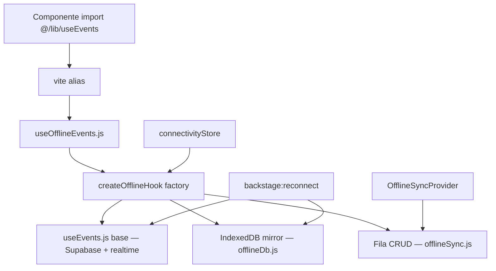

# Handoff — Offline / Sync / alias `useEvents`

**Agente:** Cursor (Trilha Técnica) — investigação READ-ONLY  
**Data:** 2026-08-28

---

## Pergunta da auditoria

> `Calendar.jsx` importa `@/lib/useEvents` — passa pelo wrapper offline?

## Resposta: **SIM** (em build/dev via Vite)

### Evidência concreta

`vite.config.js` (linhas 62–67):

```js
alias: {
  '@/lib/useEvents': path.resolve(__dirname, './src/lib/offline/useOfflineEvents.js'),
  '@/lib/useClients': path.resolve(__dirname, './src/lib/offline/useOfflineClients.js'),
  '@/lib/useExpenses': path.resolve(__dirname, './src/lib/offline/useOfflineExpenses.js'),
  '@/lib/useDailyWork': path.resolve(__dirname, './src/lib/offline/useOfflineDailyWork.js'),
},
```

`Calendar.jsx` linha 8:

```js
import { useEvents } from '@/lib/useEvents';
```

→ Resolve para `useOfflineEvents.js` → `createOfflineHook({ useBaseHook: useEvents from '../useEvents.js', ... })`.

**Caveat:** Ferramentas que resolvem paths sem Vite (ex.: jump to definition no IDE) podem abrir `src/lib/useEvents.js` diretamente — o alias só existe no bundler.

---

## Arquitetura offline



### Módulos (`src/lib/offline/`)

| Arquivo | Função |
|---------|--------|
| `useOfflineEvents.js` | Wrapper eventos |
| `useOfflineClients.js` | Wrapper clientes |
| `useOfflineExpenses.js` | Wrapper despesas |
| `useOfflineDailyWork.js` | Wrapper horas |
| `createOfflineHook.js` | Factory: mirror IDB + fila + merge |
| `offlineDb.js` | IndexedDB stores + sync queue |
| `offlineSync.js` | `processOfflineQueue`, queue create/update/delete |
| `offlineUtils.js` | `applyQueueToRows`, `OFFLINE_QUEUE_EVENT`, network errors |
| `connectivityStore.js` | Estado online único + probe Supabase |
| `useConnectivity.js` | Hook React para `connectivityStore` |
| `OfflineSyncProvider.jsx` | Flush fila ao reconectar, `pendingCount` |

### Boot

- `routes.jsx` → `OfflineSyncProvider` + `ProfileOfflineProvider` + `RealtimeSyncProvider`
- `initConnectivityMonitor()` no `OfflineSyncProvider`
- `useRealtimeRefetch` nos hooks base para multi-device

---

## Comportamento documentado (sem alteração)

| Cenário | Comportamento |
|---------|---------------|
| Online normal | Dados do Supabase via hook base; mirror IDB atualizado em background |
| Offline / erro rede | Lê mirror IDB se disponível; `error` suprimido se há cache ou pending |
| Mutação offline | Enfileira em IDB; `offlinePending` / `pendingCount` no hook |
| Reconectar | `backstage:reconnect` → `processOfflineQueue` + refetch hooks |
| Conflitos multi-device | **Sem resolução explícita** — last-write-wins na fila; sem UI de conflito |
| Pending na UI | Banner offline só sem internet (S183) — fila não exibida ao usuário |

---

## Hooks que NÃO passam pelo alias offline

| Hook | Offline? |
|------|----------|
| `useHomeDashboard.js` | Chama Supabase direto — tem cache próprio + silent refetch |
| `useBackstageData.js` | Supabase direto (legado AppDataContext) |
| `useUserSettings` | Sem wrapper offline dedicado |
| `useAuth` / profile | `ProfileOfflineProvider` cache localStorage |

---

## Realtime

- `RealtimeSyncProvider` + `useRealtimeRefetch` nos hooks base (`useEvents.js`, etc.)
- Migração `028_enable_realtime.sql` aplicada
- Reconnect dispara refetch silencioso em todos os hooks integrados

---

## Riscos para auditoria

1. **Dupla fonte de verdade:** `useHomeDashboard` vs `useEvents` offline — números podem divergir offline
2. **IDE vs runtime:** path `@/lib/useEvents` confunde auditoria manual
3. **Conflitos:** não testados E2E; fila silenciosa
4. **LOCKED files:** `useEvents.js` base não deve ser editado sem pedido — wrapper é o ponto de extensão

---

## Testes adicionados nesta sessão

- Caracterização financeira/status — ver `eventFinance.test.js`, `eventStatus.test.js`, `goalMetrics.test.js`

Nenhuma refatoração offline executada.
